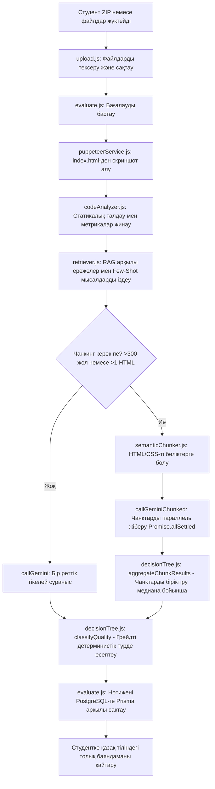

# Дипломдық жоба: HTML/CSS кодтарын автоматты түрде бағалау және рецензиялау платформасы (AI Code Review)

Бұл құжат дипломдық жобаның сәулетін (architecture), жұмыс істеу принциптерін, деректер қоры құрылымын және қажетті жерлерін өзіңізге ыңғайлы етіп өзгерту (customization) нұсқаулығын түсіндіруге арналған.

---

## 1. Жобаның жалпы құрылымы мен мақсаты

Платформа студенттер жүктеген HTML және CSS жобаларын автоматты түрде тексереді. Ол тек қана кодты талдап қоймайды, сонымен қатар:
1. **Визуалды тексеру** жасайды (Puppeteer арқылы скриншот түсіріп, интерфейсті бағалайды).
2. **Статикалық талдау** жүргізеді (семантикалық тегтерді, BEM-құрылымын, медиа-сұраныстарды есептейді).
3. **RAG (Retrieval-Augmented Generation)** арқылы білім базасынан сәйкес ережелер мен Few-Shot мысалдарды тауып, ИИ-ге жібереді.
4. **Семантикалық Чанкинг (Semantic Chunking)** арқылы үлкен жобаларды кішігірім блоктарға бөліп, Gemini API лимиттері мен уақыт шектеулерінен өтеді.
5. **Детерминистік бағалау (Decision Tree)** арқылы ИИ қателерін түзетіп, нақты баға мен грейд шығарады.
6. **Жауапты қазақ тілінде** академиялық түрде қайтарады.

---

## 2. Жүйенің Стек Технологиялары

### Frontend (React + Vite)
- **React (Vite):** Жылдам әрі жеңіл Single Page Application (SPA) құру үшін.
- **React Router Dom:** Студент пен мұғалім панельдері, кіру/тіркелу және нәтиже беттері арасында навигация.
- **XLSX және HTML2PDF:** Бағалау нәтижелерін Excel (Gradebook) және PDF ретінде экспорттау үшін.
- **Анимациялар мен Интерфейс:** Таза Vanilla CSS қолданылып, заманауи қараңғы режим (dark mode), градиенттер және әдемі өту эффектілері жүзеге асырылған.

### Backend (Node.js + Express.js)
- **Express.js:** API сервері, студенттер мен оқытушылар сұраныстарын өңдеу.
- **Puppeteer:** Студенттің HTML/CSS кодын виртуалды браузерде ашып, нақты `.png` скриншотын жасау үшін.
- **Cheerio:** HTML кодын талдап, оны семантикалық бөліктерге (header, nav, main, section, footer) жылдам бөлу үшін.
- **Google Gemini 2.5 Flash:** Жобаның визуалды бөлігі мен кодын талдайтын негізгі мультимодальді нейрожелі.
- **Prisma ORM:** PostgreSQL деректер қорымен (Supabase-те орналасқан) жұмыс істеуге арналған құрал.

---

## 3. Бағалау Конвейерінің Жұмыс Істеу Алгоритмі (Evaluation Pipeline)

Бағалау конвейері [pipeline.js](file:///Users/khim/Sabaq/diplom/testing1/backend/src/services/pipeline.js) файлында реттелген. Жұмыс істеу қадамдары:



### 1-Қадам: Статикалық талдау (`codeAnalyzer.js`)
Кодтағы нақты деректерді жинайды:
- HTML-де семантикалық тегтер саны, `alt` атрибуты жоқ суреттер, inline стильдер.
- CSS-те Flexbox/Grid қолданылуы, `!important` саны, CSS айнымалылары, медиа-сұраныстар (`@media`).
- **Бұл не үшін керек?** Бұл деректер ИИ-ге факт ретінде жіберіледі. Бұл Gemini-дің "кодта Flexbox жоқ" немесе "семантикалық тегтер қолданылмаған" деп өтірік айтуына (галлюцинация жасауына) жол бермейді.

### 2-Қадам: RAG және Контекст іздеу (`retriever.js`)
Студент кодындағы кілт сөздерді тауып, `backend/data/` ішіндегі білім базасынан сәйкес HTML/CSS ережелерін және мұғалім дайындаған Few-Shot мысалдарын таңдайды. Осылайша сұраныс көлемі үнемделіп, ИИ-ге тек релевантты ережелер беріледі.

### 3-Қадам: Семантикалық чанкинг (`semanticChunker.js`)
Егер студенттің жобасы үлкен болса (>300 жол код немесе бірнеше бет), жүйе оны бөледі:
- HTML бетін `cheerio` арқылы `<header>`, `<main>`, `<section>`, `<aside>`, `<nav>`, `<footer>` блоктарына ажыратады.
- Барлық CSS файлдарын бір чанкке біріктіреді.
- Тым кішкентай чанктерді көршілес чанктермен біріктіреді (толық бос емес чанктер үшін).
- **Параллельдік:** Бұл чанктер Gemini API-ге параллель түрде жіберіледі. Әр сұраныстың 30 секундтық таймауты бар (`AbortController`). Егер бір чанк қате берсе, ол бүкіл бағалауды құлатпайды (`Promise.allSettled`).

### 4-Қадам: Агрегация және Decision Tree (`decisionTree.js`)
- **Агрегация:** Чанктардан келген бағаларды біріктіру үшін орташа мән емес, **медиана** алынады (себебі орташа мән кездейсоқ төмен бағаланған кішкентай чанк үшін жалпы бағаны қатты төмендетіп жібереді). Қателер дедупликацияланады (категория мен сипаттамасы бойынша бірдей ескертулер жойылады).
- **Decision Tree (Шешімдер ағашы):** ИИ-дің математикалық қателерін түзетеді және қатаң академиялық шкала бойынша грейд қояды:
  - **Өте жақсы (A/B):** Жалпы балл $\ge 85$ және (HTML $\ge 25$, CSS $\ge 25$, UI $\ge 33$).
  - **Жақсы (C):** Жалпы балл $\ge 70$ және (HTML $\ge 20$, CSS $\ge 20$, UI $\ge 28$).
  - **Қанағаттанарлық (D):** Жалпы балл $\ge 50$ және UI $\ge 18$.
  - **Қанағаттанарлықсыз (F):** Қалған жағдайларда.

---

## 4. Деректер қорының құрылымы (Supabase / Prisma Schema)

Деректер қорының схемасы [schema.prisma](file:///Users/khim/Sabaq/diplom/testing1/backend/prisma/schema.prisma) файлында сипатталған:

1. **User (Пайдаланушы):** Жүйедегі рөлдерді сақтайды (`student` немесе `teacher`). Мұғалім сыныптар мен тапсырмалар жасай алады.
2. **StudentProfile:** Студенттің тобын, курсын, мамандығын және кодтық нөмірін сақтайтын профиль.
3. **Classroom (Сынып):** Мұғалім жасаған оқу тобы. Оған студенттер арнайы шақырту коды (`inviteCode`) арқылы қосылады.
4. **Assignment (Тапсырма):** Оқытушы сынып үшін жасайтын тапсырма (дедлайн, максималды әрекеттер саны).
5. **Submission (Жұмыс):** Студент тапсырған жұмыс. Оның күйі (`pending`, `processing`, `done`, `error`) мен әрекет нөмірі (`attempt`) сақталады.
6. **SubmissionFile:** Студент жүктеген кодтық файлдар (HTML, CSS стильдері).
7. **Evaluation (Бағалау нәтижесі):** Бағалаудың жалпы балы, HTML/CSS/UI бойынша жеке балдар, грейд және ИИ ұсынған даму жолы мен келесі әрекетте нені жақсарту керектігі туралы кеңестер (JSON форматында).
8. **AiFeedbackItem (Кері байланыс):** Кодтың қай жерінде қате бар, оны қалай түзету керек және қандай оқу материалдарын оқу қажет екені туралы қазақ тіліндегі кеңестер тізімі.

---

## 5. Жоба файлдарының картасы

### Backend
- [server.js](file:///Users/khim/Sabaq/diplom/testing1/backend/server.js) — Серверді қосу және API маршруттарын тіркеу.
- [db.js](file:///Users/khim/Sabaq/diplom/testing1/backend/src/db.js) — Prisma клиентін экспорттайтын файл.
- [src/routes/](file:///Users/khim/Sabaq/diplom/testing1/backend/src/routes) — API роутерлері:
  - `auth.js` — Аутентификация және тіркелу.
  - `classroom.js` — Сыныптарды басқару.
  - `upload.js` — Файлдарды қабылдап, валидация жасап, дискке сақтау.
  - `evaluate.js` — Бағалау процесін іске қосу және нәтижені ДҚ-ға жазу.
  - `student.js` / `teacher.js` — Сәйкес панельдерге арналған статистика мен деректер сұраныстары.
- [src/services/](file:///Users/khim/Sabaq/diplom/testing1/backend/src/services) — Логикалық сервистер:
  - `pipeline.js` — Тексеріс конвейерін басқару.
  - `semanticChunker.js` — Кодты семантикалық чанктерге бөлуші.
  - `geminiService.js` — Gemini API-ге сұраныс жіберу және JSON алу.
  - `codeAnalyzer.js` — Статикалық анализатор (метрика жинау).
  - `decisionTree.js` — Агрегация және грейд қою ережелері.
  - `retriever.js` — RAG жүйесі (кілт сөздер бойынша іздеу).
  - `puppeteerService.js` — Браузерде бетті ашып, скриншот алу.
- [src/prompts/expertSystemPrompt.js](file:///Users/khim/Sabaq/diplom/testing1/backend/src/prompts/expertSystemPrompt.js) — Gemini моделіне арналған ең маңызды жүйелік нұсқаулық (System Prompt).

### Frontend
- [src/App.jsx](file:///Users/khim/Sabaq/diplom/testing1/frontend/src/App.jsx) — Маршруттау (routing) және рөлдерге сәйкес парақшаларға бағыттау.
- [src/pages/](file:///Users/khim/Sabaq/diplom/testing1/frontend/src/pages):
  - `LoginPage.jsx` / `RegisterPage.jsx` — Авторизация беттері.
  - `StudentDashboardPage.jsx` — Студенттің жеке кабинеті, сыныпқа қосылу, тапсырмаларды көру.
  - `UploadPage.jsx` — Жоба файлдарын сүйреп әкелу (Drag & Drop) арқылы жүктеу парақшасы.
  - `ResultPage.jsx` — Тексеру нәтижесінің толық визуализациясы (диаграммалар, қателер тізімі, кодекстің интерактивті көрінісі, PDF/Excel-ге экспорттау батырмалары).
  - `TeacherDashboardPage.jsx` — Оқытушы кабинеті, сыныптар құру, тапсырма қосу, студенттерді бақылау.
  - `SubmissionsPage.jsx` — Барлық тапсырылған жұмыстарды көру беті.

---

## 6. Жобаны қалай өзгертуге болады (Customization Guide)

Егер сізге дипломды қорғауға дайындық барысында немесе сұрақтар туындағанда кодты өзгерту керек болса, келесі нұсқауларды орындаңыз:

### А. ИИ бағалау критерийлерін немесе промпты өзгерту
Егер сізге ИИ-дің беретін жауаптарын, кері байланыс тонын немесе бағалау ережелерін өзгерткіңіз келсе:
1. [expertSystemPrompt.js](file:///Users/khim/Sabaq/diplom/testing1/backend/src/prompts/expertSystemPrompt.js) файлын ашыңыз.
2. Мұнда қазақ тілінде жазылған **System Prompt** орналасқан.
3. Егер жаңа ереже қосу керек болса, `Білім Картасы (Knowledge Maps)` бөліміне жаңа пункт ретінде қосыңыз немесе бағаны азайту (penalty) шарттарын өзгертіңіз.
4. Сондай-ақ, ИИ дұрыс форматта жауап беруі үшін промпт ішінде екі Few-Shot мысалы келтірілген (біреуі 85 баллға, екіншісі 35 баллға). Соларды өзгерту арқылы ИИ-дің жауап беру үлгісін басқара аласыз.

### Ә. Статикалық талдау ережелерін өзгерту
Егер сіз кодтан жаңа статикалық метрика жинағыңыз келсе (мысалы, JavaScript файлдарының бар-жоғын немесе Tailwind қолданылғанын тексеру):
1. [codeAnalyzer.js](file:///Users/khim/Sabaq/diplom/testing1/backend/src/services/codeAnalyzer.js) файлын ашыңыз.
2. `analyzeHTML` немесе `analyzeCSS` функцияларына жаңа RegExp сүзгілерін қосыңыз.
3. Мысалы, CSS-те `grid` тегінің қолданылуын тексеру үшін:
   ```javascript
   const hasGrid = /display\s*:\s*grid/i.test(css);
   ```
4. Жаңа метриканы қайтаратын объектіге тіркеңіз. Содан кейін оны Gemini-ге жіберетін промпт ішіне қосыңыз.

### Б. Грейд қою шектерін (Grade Thresholds) өзгерту
Егер сізге бағалау грейдтерін басқаша есептеу керек болса:
1. [decisionTree.js](file:///Users/khim/Sabaq/diplom/testing1/backend/src/services/decisionTree.js) файлын ашыңыз.
2. `classifyQuality(scores)` функциясын табыңыз.
3. Өзгерту енгізіңіз. Мысалы, егер "Өте жақсы" дегенді 90 баллдан бастағыңыз келсе:
   ```diff
   - if (total >= 85 && html >= 25 && css >= 25 && ui >= 33) {
   + if (total >= 90 && html >= 27 && css >= 27 && ui >= 36) {
   ```

### В. Деректер қорына жаңа өріс (Field) қосу
Егер пайдаланушы профиліне немесе бағалауға жаңа өріс қосу қажет болса:
1. [schema.prisma](file:///Users/khim/Sabaq/diplom/testing1/backend/prisma/schema.prisma) файлын ашыңыз.
2. Керекті модельге жаңа өрісті жазыңыз, мысалы, студент профиліне телефон нөмірін қосу:
   ```prisma
   model StudentProfile {
     // ... ескі өрістер
     phone String?
   }
   ```
3. Терминалда `backend` қалтасына өтіп, мына команданы іске қосыңыз:
   ```bash
   npx prisma migrate dev --name add_phone_to_profile
   ```
4. Бұл команда PostgreSQL-дегі кестені автоматты түрде жаңартады және Prisma клиентін қайта генерациялайды.

---

## 7. Жүйені іске қосу және тексеру

Бағдарламаның дұрыс істейтінін тексеру үшін:
- **Backend:** `cd backend && npm run dev` (порт 3000-де іске қосылады).
- **Frontend:** `cd frontend && npm run dev` (порт 5173-де іске қосылады).

Осы құжатты негізге ала отырып, диплом қорғау кезінде комиссия мүшелерінің сұрақтарына сенімді жауап бере аласыз. Сәттілік!
